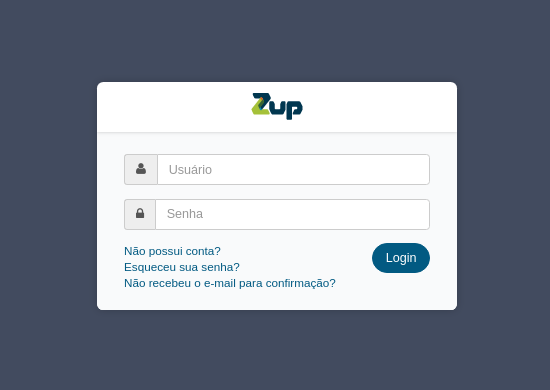

# MÓDULOS API MANAGER

A solução de gestão de APIs é composta por 3 módulos: API Manager, User Manager e API Gateway. 

## 1.API Manager

O API Manager (APM) é uma plataforma completa de gestão de APIs que visa acelerar o desenvolvimento de integrações entre sistemas e facilitar o processo de externalização de serviços para uso interno, externo e/ou de parceiros.

Toda a plataforma foi construída pensando no conceito de atendimento multicanal, facilitando e reduzindo os custos do desenvolvimento de user interfaces como web, mobile, URA, SMS, entre outros, de forma centralizada e organizada. Para tanto foi criada uma camada ágil conectada aos sistemas internos da empresa onde com apenas um click a empresa pode fazer deploy de uma nova versão das APIs e disponibilizá-la para milhares de developers.

É composto pelos seguintes módulos:

* APIs

* Ambientes

* Aplicações

* Dashboard

* Logs

* Configuração

* Relatórios

* Portal De Desenvolvedores

## 2.User Manager

O User Manager (USM) é uma plataforma de gestão de organizações e usuários. Pode ser acessado somente pelo Administrador Geral ou Administrador da Organização.

É composto pelos seguintes módulos:

* Organização

* Autenticação

* Administradores

* Aplicações

## 3.API Gateway

O API Gateway (GW), como o nome diz, é o gateway ou entrypoint que recebe todas as requisições realizadas às APIs do API Manager e redireciona aos endpoints corretos.

## 4. Conceitos Básicos

O API Manager possui alguns conceitos básicos cujo entendimento é imprescindível para sua utilização.

# Organização ##

É a entidade principal, funcionando como um agrupador de todas as demais entidades do sistema. Cada Organização possui um identificador único (slug) indispensável para que o sistema possa ser acessado. Várias Organizações podem co-existir no API Manager graças ao sistema multi-tenant, que garante o isolamento das informações.

# Entrypoint #

É uma instância do API Gateway, que pode estar localizada tanto nos servidores do Zup.me na nuvem quanto em uma rede privada. No modelo SaaS, o Zup.me oferece 03 (três) Entrypoints públicos (production, staging e development) para facilitar a separação de ambientes. Os Entrypoints podem ser gerenciados através da interface do API Manager.

# Endpoint #

É o servidor que responde pela API, normalmente separado por ambientes. Endpoints podem ser gerenciados por meio da interface do API Manager. Ao realizar o deploy de uma API é necessário escolher o Entrypoint e o Endpoint.

# API #

API (Application Programming Interfaces) é um conjunto de operações providas por softwares que permitem a utilização de suas funcionalidades por aplicativos sem expor maiores detalhes de implementação.

A configuração de APIs é a principal funcionalidade do API Manager, sendo assim, todos os conceitos estão intimamente ligados a APIs.

Todas as APIs criadas no API Manager são versionadas por padrão.

# Recurso #

Um Recurso pode ser entendido como uma unidade de informação, identificado por uma URI (Uniform Resource Identifier) única, cujas operações são definidas por um conjunto de métodos HTTP.

No API Manager, cada API é composta por um conjunto de Recursos.

# Método #

Todas as ações/operações sobre um Recurso disponibilizadas pela API devem ser implementadas utilizando-se métodos HTTP que indicam a ação/operação a ser executada.

São eles: GET, POST, PUT, DELETE, PATCH, OPTIONS, CONNECT, HEAD, TRACE.

# Aplicação #

É a entidade responsável por expor APIs  da Organização e identificar os seus  consumidores. Isso é feito por meio de credenciais que devem ser informadas em todas as requisições feitas para o Entrypoint.

Funciona como um agrupador de APIs, delimitando o que pode ou não ser acessado. Também permite a adição de diferentes Add-ons, como políticas de segurança e cache.

# REST #

A arquitetura REST conta com a utilização de conceitos do protocolo HTTP para construir APIs. Em REST, uma API pode ser definida como um conjunto de Recursos (unidades de informação) com afinidades lógicas entre si disponibilizados através de um servidor Web à clientes

## 5. Acesso ao Sistema

O acesso ao sistema se dá pela URL <slug>.zup.me.

Por exemplo: ngbank.zup.me acessa uma organização cujo slug é ngbank. Ao acessar o sistema será apresentada a página de login.

